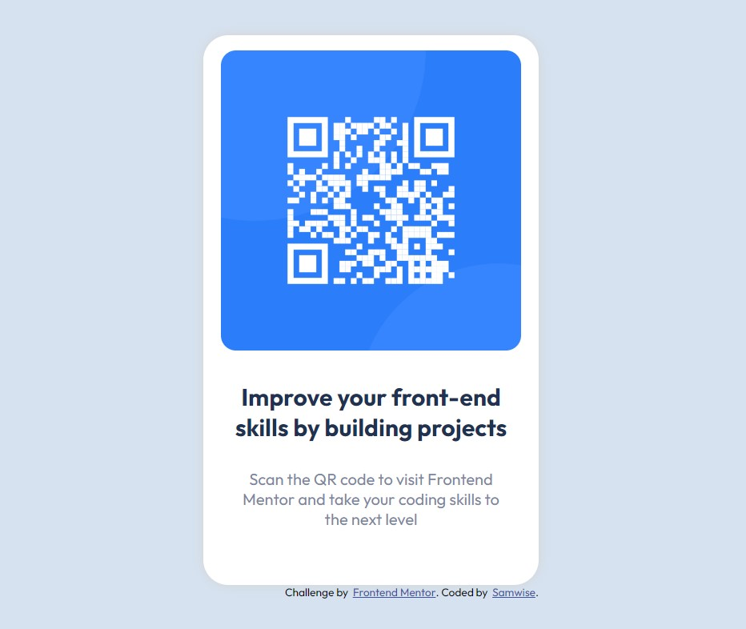

## Table of contents

- [Overview](#overview)
  - [Screenshot](#screenshot)
  - [Links](#links)
- [My process](#my-process)
  - [Built with](#built-with)
  - [What I learned](#what-i-learned)
  - [Continued development](#continued-development)
  - [Useful resources](#useful-resources)
- [Author](#author)
- [Acknowledgments](#acknowledgments)

## Overview

- This is a solution to the [QR code component challenge on Frontend Mentor](https://www.frontendmentor.io/challenges/qr-code-component-iux_sIO_H). Frontend Mentor challenges help you improve your coding skills by building realistic projects. 

### Screenshot

### Links

- Solution URL: [Add solution URL here](https://github.com/samwise-webdev/qr-code-component-main)

## My process

- Identify the different components that probably make up the final design
- Begin to break down the HTML into those parts
- Create CSS Stylesheet while braking down HTML

### Built with

- HTML5
- CSS
- Flexbox
- Mobile-first workflow

### What I learned

- I had some difficulty getting things to align/justify properly so I moved around the justify-content, display: flex;, and align-items properties around a few times and looked for some help on the internet on how to make those work as I wanted them to.

### Continued development

- It is important for me to continue practicing with flexbox because there are still a lot of nuances that I don't fully understand with it.

### Useful resources

- I have been using Colt Steele's Web Dev Bootcamp to learn HTML/CSS and will be starting on JavaScript soon. It has been very helpful (https://www.udemy.com/course/the-web-developer-bootcamp/)

## Author

- Website - [Samwise](https://github.com/samwise-webdev)
- Frontend Mentor - [@samwise-webdev](https://www.frontendmentor.io/profile/samwise-webdev)

## Acknowledgments

Myself :) 